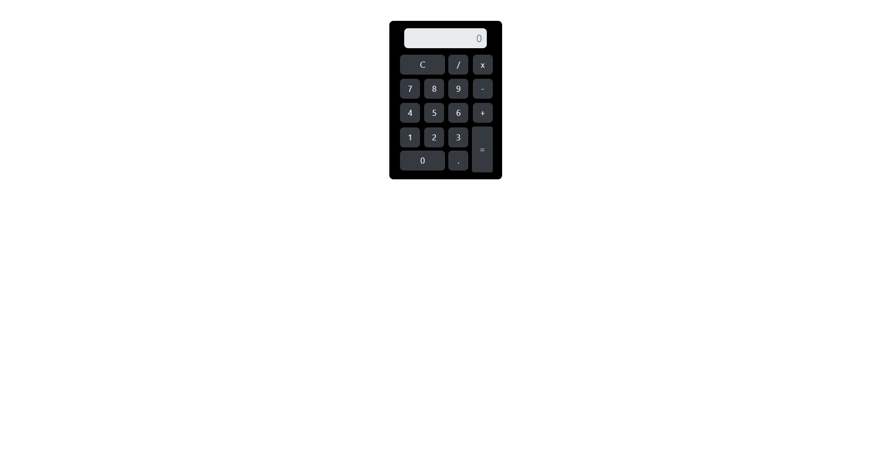

<h1 align="center"> Calculadora </h1>

calculadora é um app público disponível para todos.

 

  

## ✔ Tecnologias

Esse projeto foi desenvolvido com as seguintes tecnologias:

- HTML e CSS
- JavaScript
- Git e Github

## 💻 Projeto

A Calculadora é um app para te ajudar a resolver seus problemas matemáticos de forma rápida.

- [Visite o projeto online] (https://patrickpicon.github.io/calculadora/)
